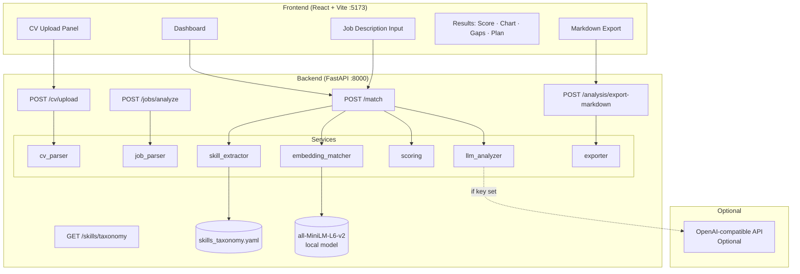
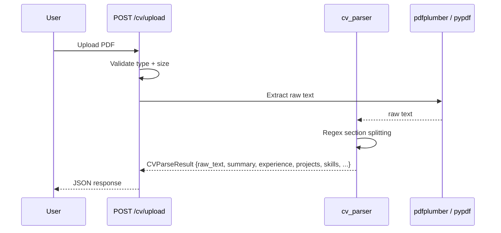
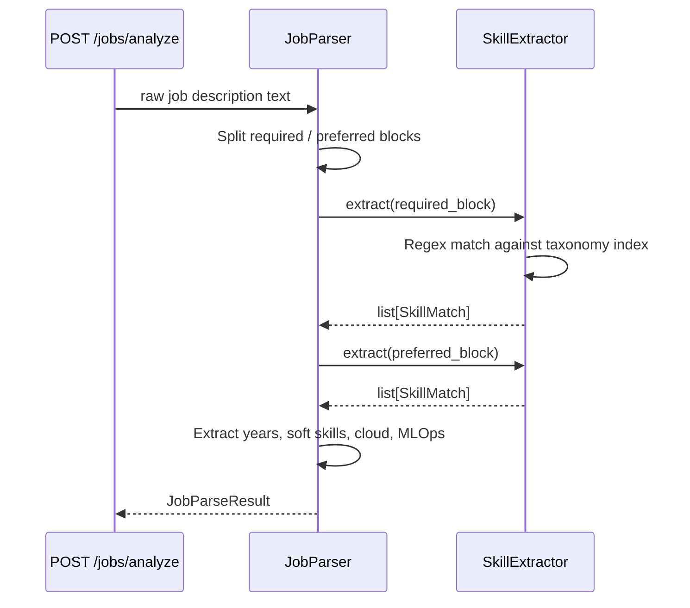
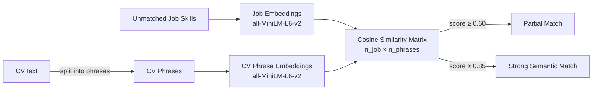
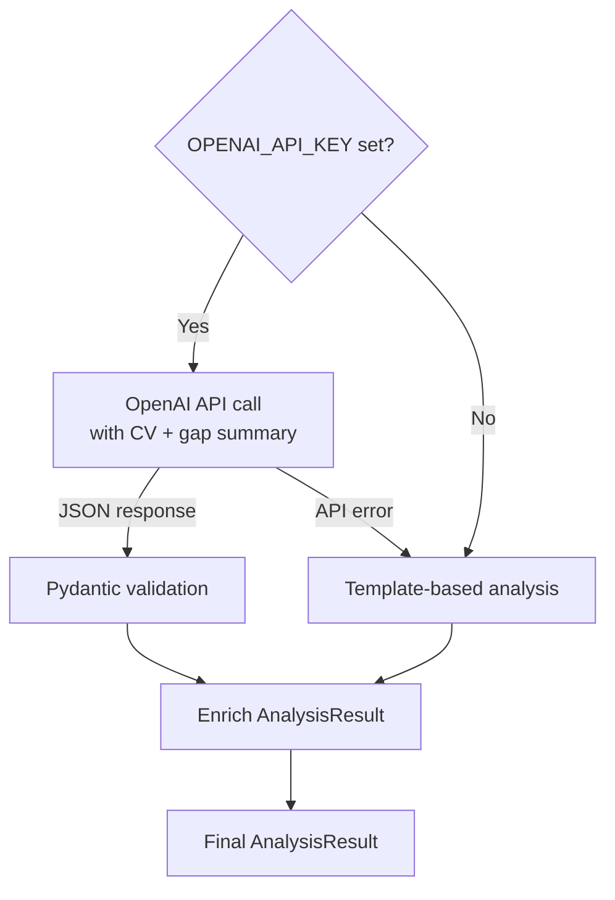

# ARCHITECTURE.md — AI Career Gap Analyzer

## System Architecture



## CV Parsing Flow



## Job Parsing Flow



## Skill Extraction Flow

```
skills_taxonomy.yaml
        │
        ▼
SkillExtractor._build_index()
        │   term_index: {synonym → (canonical_skill, category)}
        ▼
SkillExtractor.extract(text)
        │   Regex word-boundary search for each term
        │   Deduplication by canonical name
        ▼
list[SkillMatch] {skill, category, evidence, similarity_score=1.0}
```

## Embedding Matching Flow



## Scoring Flow

```
cv_skills (exact) ∩ job_skills → exact_matches
job_skills \ exact_matches → unmatched_job_skills
  → EmbeddingMatcher → partial_matches (0.60–0.85 threshold)

For each category:
  category_score = (exact × 0.6 + partial × 0.4) / required_in_category × 100

total_fit_score = weighted_avg(category_scores, CATEGORY_WEIGHTS) × 0.6
                + (exact × 0.6 + partial × 0.4) / total_required × 100 × 0.4
```

## Optional LLM Analysis Flow



## Frontend Flow

```
User lands on Dashboard
    ↓
CvUploadPanel: PDF upload → POST /cv/upload → raw_text
    OR paste CV text directly
JobDescriptionInput: paste job description text
    ↓
Click "Analyze Fit" → POST /match
    ↓
Loading state → results rendered:
    FitScoreCard (circular gauge)
    SkillGapTable (matches + gaps)
    CategoryChart (radar + bar chart)
    RecommendationPanel (projects + resume + 30/60/90 plan)
    ExportPanel → POST /analysis/export-markdown → .md download
```

## Key Design Decisions

| Decision | Choice | Reason |
|---|---|---|
| Embedding model | all-MiniLM-L6-v2 | Fast, no API, good semantic quality |
| Scoring | Deterministic weighted formula | Reproducible, explainable |
| LLM | Optional OpenAI-compatible | Works without paid key |
| Taxonomy | YAML file | Human-editable, version-controlled |
| Backend | FastAPI | Async, auto-docs, Pydantic native |
| Frontend | React + Vite + Tailwind | Modern DX, fast build |
