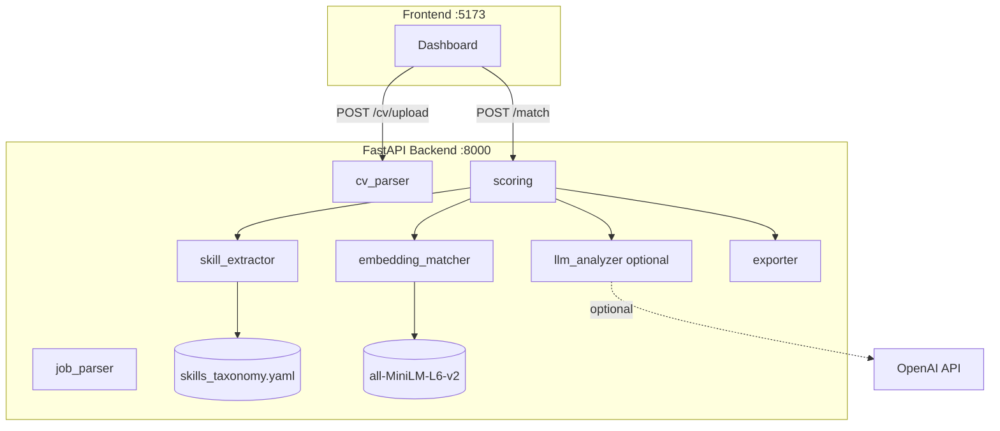

# AI Career Gap Analyzer


A full-stack AI application that compares a candidate CV against AI/ML Engineer job descriptions, extracts required skills, identifies gaps, scores fit with a deterministic formula, and generates a structured improvement plan.

Works fully offline — no API key required. Optional LLM enrichment via any OpenAI-compatible API.

> **Disclaimer**: This tool is for guidance only. It does not replace professional career advice, human recruiters, or guarantee hiring outcomes. It does not invent candidate experience.

---

## Features

- **PDF & Text CV Upload** — parse PDF resumes with section extraction (summary, experience, projects, skills, education)
- **Job Description Analysis** — extract required/preferred skills, tools, cloud requirements, and years of experience
- **Skills Taxonomy** — 15 categories, 70+ canonical skills, 200+ synonyms (RAG, LLMOps, MLOps, Cloud, NLP, etc.)
- **Exact Skill Matching** — keyword + synonym normalisation with evidence snippets
- **Semantic Matching** — sentence-transformers (`paraphrase-multilingual-MiniLM-L12-v2`) cosine similarity for partial matches, with full Spanish/English support
- **Explainable Fit Score** — 0–100 score with category breakdown and plain-English explanation
- **Gap Analysis** — exact list of missing required and preferred skills
- **Optional LLM Enrichment** — profile summary, recommendations, resume suggestions, and 30/60/90 day plan
- **Deterministic Fallback** — all features work without any paid API key
- **Markdown Export** — download full analysis report
- **React Dashboard** — clean UI with circular gauge, radar chart, skill gap table, recommendation panels

---

## Tech Stack

| Layer | Technology |
|---|---|
| Backend | Python 3.11, FastAPI, Pydantic v2 |
| Embeddings | sentence-transformers `paraphrase-multilingual-MiniLM-L12-v2` (local, multilingual) |
| Similarity | scikit-learn cosine similarity |
| PDF Parsing | pdfplumber + pypdf (fallback) |
| Optional LLM | OpenAI-compatible API (gpt-4o-mini) |
| Frontend | React 18, TypeScript, Vite, Tailwind CSS, Recharts |
| DevOps | Docker, docker-compose, GitHub Actions |
| Testing | pytest (no API key required) |

---

## Architecture



---

## Matching Methodology

### 1. Exact Matching
Skills are extracted from CV and job description using a YAML taxonomy with 200+ synonyms.
`"distilbert"` → normalised to `"transformers"`. `"chromadb"` → `"vector database"`.
Exact matches carry weight `0.6` in the category score.

### 2. Semantic Matching
The CV is split into overlapping 2-sentence chunks for context preservation. Each unmatched job skill is embedded using
`paraphrase-multilingual-MiniLM-L12-v2` (supports Spanish and English). Cosine similarity between job skill embedding and CV phrase embeddings:
- ≥ 0.75 → strong semantic match
- 0.60–0.75 → partial match (weight `0.4`)
- < 0.60 → missing

### 3. Category Scoring
Skills are grouped into 15 categories (Generative AI, MLOps, Machine Learning, etc.).
Each category has an importance weight:

| Category | Weight |
|---|---|
| Generative AI | 18% |
| Machine Learning | 15% |
| LLMOps | 12% |
| MLOps | 10% |
| Deep Learning | 10% |
| NLP | 8% |
| Software Engineering | 8% |
| Backend APIs | 6% |
| Cloud | 6% |

### 4. Total Fit Score
```
total_score = weighted_avg(category_scores) × 0.6 + coverage_ratio × 100 × 0.4
```
Score is fully deterministic and reproducible.

---

## Skills Taxonomy

The taxonomy lives in `backend/configs/skills_taxonomy.yaml` and is human-editable.

Example entries:
```yaml
Generative AI:
  - skill: retrieval augmented generation
    synonyms: [rag, rag pipeline, retrieval-augmented generation]
  - skill: large language models
    synonyms: [llm, genai, generative ai]

LLMOps:
  - skill: vector database
    synonyms: [chromadb, pinecone, qdrant, faiss, weaviate, semantic search]
```

---

## API Documentation

Interactive docs at http://localhost:8000/docs

### `POST /match`
```json
{
  "cv_text": "...",
  "job_descriptions": ["..."],
  "use_llm": false
}
```

Response:
```json
{
  "fit_score": 72.4,
  "category_scores": {
    "Generative AI": 45.0,
    "Machine Learning": 85.0,
    "MLOps": 60.0
  },
  "strong_matches": [
    {"skill": "fastapi", "category": "Backend APIs", "evidence": "...built FastAPI endpoints...", "similarity_score": 1.0}
  ],
  "partial_matches": [...],
  "missing_required_skills": ["kubernetes", "llm fine-tuning"],
  "missing_preferred_skills": [...],
  "recommendations": ["Build a RAG pipeline project with Pinecone and LangChain"],
  "resume_suggestions": ["Quantify achievements with metrics"],
  "learning_plan": {
    "days_30": ["Complete LangChain tutorial"],
    "days_60": ["Build end-to-end RAG project"],
    "days_90": ["Apply to target roles"]
  },
  "explanation": "Overall fit score: 72.4/100. Exact matches: 12. Missing: kubernetes, llm fine-tuning."
}
```

---

## Running Locally

### Requirements
- Python 3.11+
- Node 20+

### Backend
```bash
# Install
make install-backend

# Copy env
cp .env.example .env

# Start (hot-reload)
make run-backend
# → http://localhost:8000
# → http://localhost:8000/docs
```

### Frontend
```bash
make install-frontend
make run-frontend
# → http://localhost:5173
```

### Tests
```bash
make test
# No API key required
```

---

## Docker

```bash
# Build and start both services
make docker-up

# Stop
make docker-down
```

URLs:
- Frontend: http://localhost:5173
- Backend: http://localhost:8000
- API docs: http://localhost:8000/docs

---

## Optional LLM Configuration

Add to `.env`:
```
OPENAI_API_KEY=sk-...
OPENAI_BASE_URL=https://api.openai.com/v1
OPENAI_MODEL=gpt-4o-mini
```

When set, the `/match` endpoint with `"use_llm": true` will call the LLM API to generate:
- A tailored profile summary (from CV content only — no invention)
- A fit assessment
- Personalised project recommendations
- Resume improvement suggestions
- A 30/60/90 day learning plan

**Without a key**, all features work using deterministic template-based analysis.

You can use any OpenAI-compatible API (Azure OpenAI, local Ollama, etc.) by changing `OPENAI_BASE_URL`.

---

## Screenshots

> Replace these placeholders with actual screenshots after running the app.

| Screen | Description |
|---|---|
| `screenshots/dashboard-input.png` | CV upload + job description input panels |
| `screenshots/fit-score.png` | Circular fit score gauge |
| `screenshots/skill-gap-table.png` | Strong matches, partial matches, missing skills |
| `screenshots/category-chart.png` | Radar chart by skill category |
| `screenshots/recommendations.png` | Project recommendations + 30/60/90 plan |
| `screenshots/export.png` | Markdown export download |

---

## Example Output

For `sample_cv.txt` (Python + FastAPI + RAG + MLflow engineer) vs `ai_engineer_job.txt`:

- **Fit Score**: ~68–75/100
- **Strong Matches**: fastapi, retrieval augmented generation, mlflow, docker, python, langchain
- **Partial Matches**: vector database (via ChromaDB), transformers (via DistilBERT)
- **Missing**: kubernetes, llm fine-tuning (LoRA/QLoRA), llm evaluation, agentic frameworks

---

## Limitations

- PDF parsing requires text-based PDFs (scanned/image PDFs are not supported)
- Skill extraction is keyword-based; highly domain-specific jargon not in the taxonomy may be missed
- Fit score is a heuristic, not a ground-truth label
- LLM analysis quality depends on the model and API availability
- Partial match threshold (0.60) may produce false positives for very short CV phrases

---

## Future Improvements

- OCR support for scanned PDFs
- Multi-job comparison (radar chart across multiple roles)
- LinkedIn URL as CV input
- Salary range estimation by skill gap
- Interview preparation question generation
- Persistent analysis history with optional user accounts

---

## Skills Demonstrated

| Skill | Where Demonstrated |
|---|---|
| LLM Application Engineering | `llm_analyzer.py`, structured JSON output, Pydantic validation |
| Prompt Engineering | System prompt design, structured output prompting |
| RAG Concepts | Embedding-based retrieval in `embedding_matcher.py` |
| Embeddings | sentence-transformers, cosine similarity, semantic matching |
| Explainable AI | Deterministic scoring formula with category breakdown |
| MLOps Tooling | MLflow mentioned in taxonomy + example data |
| FastAPI | Full async API with Pydantic v2, file upload, error handling |
| React + TypeScript | Clean component architecture, type-safe API integration |
| Testing | pytest suite, no external dependencies required |
| Docker | Multi-stage builds, docker-compose, health checks |
| CI/CD | GitHub Actions pipeline |
| Clean Architecture | Services, schemas, API layers separated |
